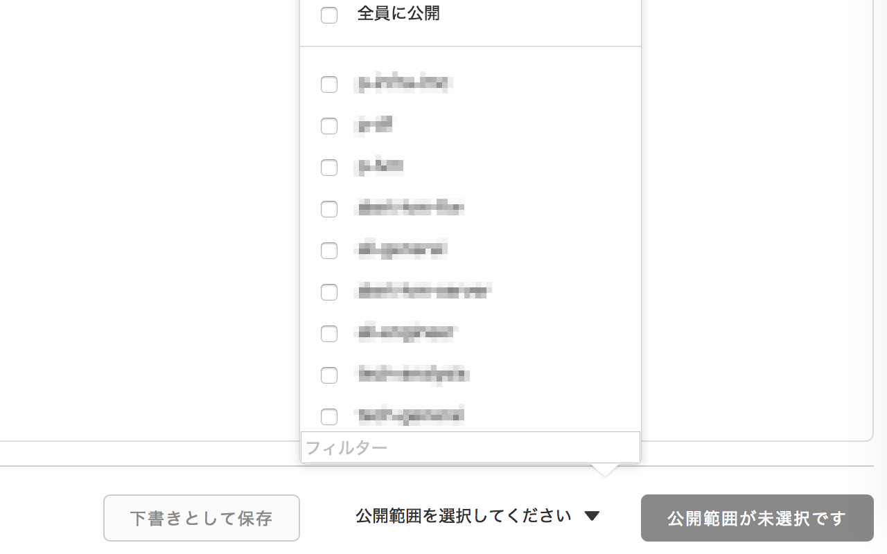
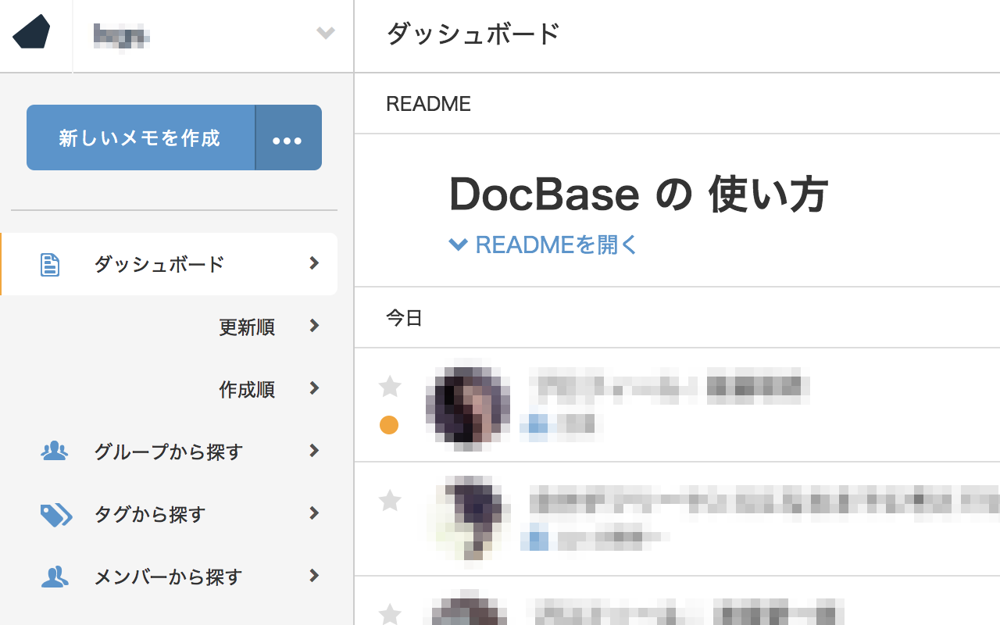

# DocbaseExtender

**このExtensionはDocbase公式のものではありません。**

## 機能

### グループフィルタ

公開範囲選択時に、フィルターを入力し一致するグループのみ表示することができます

### ナビゲーションの追加

ナビゲーションにリンクを追加します

* デフォルトでは「更新順」「作成順」のリンクが追加されます
  * 更新順：公開範囲「全員」を除いた記事を更新順に表示します
  * 作成順：公開範囲「全員」を覗いた記事を作成順に表示します
* Extensionのメニューから「「全員」を表示しない」のチェックボックスを外すと「作成順」のリンクのみ追加されます
  * ダッシュボードはデフォルトで更新順なので「更新順」リンクは追加されません

## change log

### 0.3.0

* 「全員」を除くリンクをナビゲーションに追加する機能を実装
* TypeScript化

### 0.2.0

* bug fix

### 0.1.0

* 初版